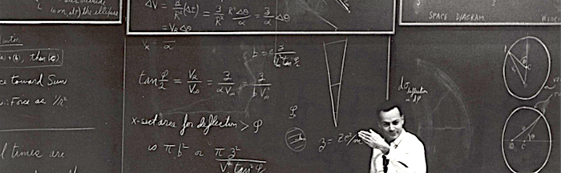

# Machine Learning Feynman Experience

> "What I cannot create, I do not understand" - Feynman.

This is a collection of concepts I tried to implement using Python on [Google Colaboratory](https://colab.research.google.com/notebooks/welcome.ipynb). If you want to play with the code, feel free to copy the notebook and have fun.

- [Markov Chains](https://colab.research.google.com/drive/104V2fY3wQc5m0af_xm7DsRNgpiVPh8x-)

### Work in progress

- Univariate frequentist estimation

### Todo list

- \[ \] Taylor series application
- \[ \] Central Limit Theorem and Law of Large Numbers.
- \[ \] Bias-Variance tradeoff
- \[ \] Univariate bayesian estimation
- \[ \] Expectation maximization
- \[ \] Linear regression
- \[ \] Logistic regression
- \[ \] Poisson regression
- \[ \] Binomial regression
- \[ \] Decision Tree
- \[ \] Random Forest
- \[ \] Perceptron
- \[ \] Autoregressive models

### Contributions

If you spot a mistake or terrible omission, please feel free to create a new issue.

### References

- DeGroot, M. H., & Schervish, M. J. (2012). Probability and statistics. Pearson Education.
- **Cover image**: Dr. Richard Feynman during the Special Lecture: *the Motion of Planets Around the Sun*. Public Domain. Created: 13 March 1964. 
