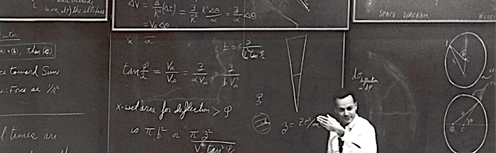

# Machine Learning Feynman Experience

> "What I cannot create, I do not understand" - Feynman.

This is a collection of concepts I tried to implement using only [Python](https://www.python.org/), [NumPy](http://www.numpy.org/) and [SciPy](https://www.scipy.org/scipylib/index.html). The notebooks live in the [`notebooks/`](notebooks/) directory — feel free to clone the repo and have fun.

## Notebooks

- [Law of large numbers](notebooks/law-of-large-numbers.ipynb)
- [Markov chains](notebooks/markov-chains.ipynb)
- [Single parameter frequentist inference](notebooks/single-parameter-frequentist-inference.ipynb)
- [Simple linear regression](notebooks/simple-linear-regression.ipynb)
- [Multiple linear regression](notebooks/multiple-linear-regression.ipynb)

### Work in progress

- Generalized linear models
- Expectation maximization

### To do

- \[ \] Principal component analysis
- \[ \] Linear discriminant analysis
- \[ \] Central limit theorem
- \[ \] Single parameter bayesian inference
- \[ \] Decision tree
- \[ \] Random Forest
- \[ \] Support vector machine
- \[ \] Perceptron
- \[ \] Gradient boosting machine
- \[ \] Autoregressive models

### Contributions

If you spot a mistake or omission, please feel free to create a new issue.

### References

- Casella, G., & Berger, R. L. (2002). Statistical inference (Vol. 2). Pacific Grove, CA: Duxbury.
- Costa, M. A. (2019). Tópicos em ciência dos dados: Introdução aos modelos paramétricos e seus aplicações utilizando o R. Bonecker.
- DeGroot, M. H., & Schervish, M. J. (2012). Probability and statistics. Pearson Education.
- Hastie, T., Tibshirani, R., & Friedman, J. H. (2009). The elements of statistical learning: data mining, inference, and prediction (2nd ed). New York, NY: Springer.
- **Cover image**: Dr. Richard Feynman during the Special Lecture: *the Motion of Planets Around the Sun*. Public Domain. Created: 13 March 1964. 
